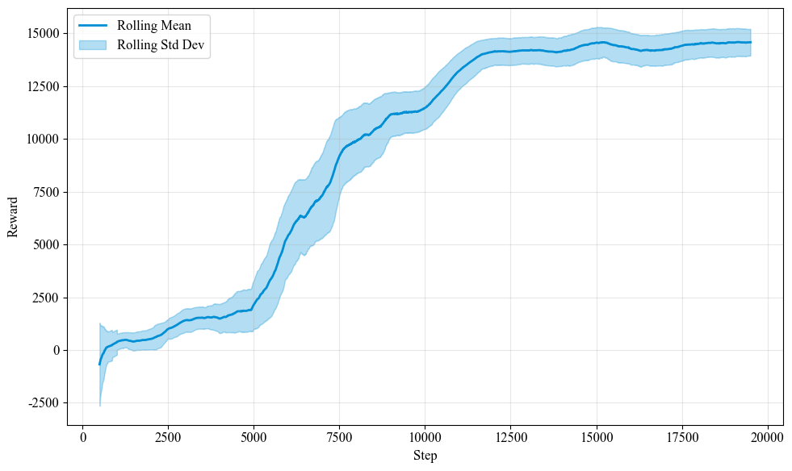
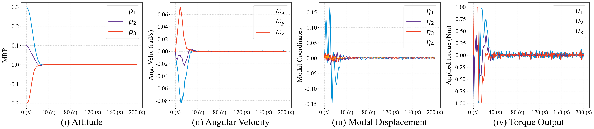
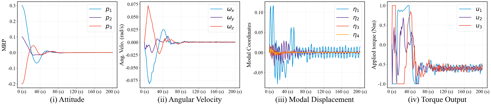
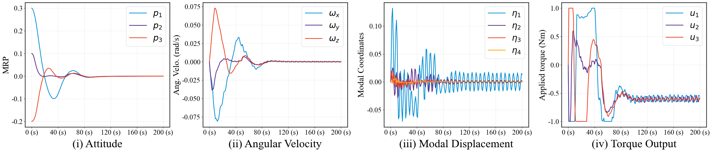

# RL-Flexible-Spacecraft

## Deep RL for Flexible Spacecraft Attitude Tracking Control with Fault Tolerance

[](https://www.python.org/)
[](https://pytorch.org/)
[](https://www.gymlibrary.dev/)
[](LICENSE)

---

## Overview

This project applies the **Twin Delayed DDPG (TD3)** deep reinforcement learning
algorithm to the problem of **attitude tracking control for flexible spacecraft**.
The spacecraft's flexible dynamics — including solar panel vibrations and
structural modes — are modeled alongside rigid-body kinematics using **Modified
Rodrigues Parameters (MRP)**. The RL-trained controller is benchmarked against
classical PD control and robust control methods under a progressive ladder of
disturbance and fault scenarios.

### Key Features

- **Flexible Spacecraft Dynamics**: Full rigid-flexible coupled dynamics with
  4 vibration modes, modeled via coupled ODEs and solved with
  `scipy.integrate.solve_ivp` (RK45).
- **MRP Kinematics**: Non-singular attitude representation using Modified
  Rodrigues Parameters, avoiding the unit-norm constraint of quaternions.
- **State Observer**: A nonlinear observer estimates unmeasurable flexible
  modal coordinates (η, χ) from measurable attitude and angular velocity,
  enabling practical output-feedback control.
- **TD3 Reinforcement Learning**: Model-free RL controller trained to minimize
  attitude error and suppress structural vibrations, with elite-model
  preservation during training. Two agent variants: **A** (with η-reward) and
  **A0** (without), to isolate the effect of explicit vibration-suppression
  reward.
- **Adaptive Fault-Tolerant (AFT) Control**: Integral sliding mode controller
  with online-adaptive switching gain for robustness against actuator faults
  and external disturbances.
- **Hybrid RL+AFT Architecture**: TD3 provides the nominal control signal,
  while the AFT layer adds robustness — combining the optimality of RL with
  the safety guarantees of robust control.
- **Three-Switch Robustness Framework**: Boolean flags (`use_param_uncertainty`,
  `use_measurement_noise`, `use_disturbance`) independently gate model-plant
  mismatch, sensor noise injection, and external disturbance. The flags are
  checked in the dynamics/step logic (not just stored), ensuring dead-code-free
  operation.
- **5 Evaluation Scenarios (S0–S4)**: A progressive uncertainty ladder from
  pure baseline (S0) through sensor noise (S1–S2), parameter mismatch +
  disturbance (S3), to full-stress with actuator faults (S4).
- **Automated Comparison Tables**: `extract_comparison_table.py` parses executed
  notebook outputs, extracts steady-state and transient performance metrics,
  and generates both Markdown and LaTeX comparison tables with bolded best
  values.
- **LaTeX Assets**: Complete compilable `.tex` documents for scenario settings
  table and S0–S4 performance comparison tables, ready for paper inclusion.

---

## Project Structure

```text
RL-Flexible-Spacecraft/
├── TD3.py                                    # TD3 algorithm
├── spacecraft_flex_ft_obs_noeta_env_MRP.py   # Spacecraft dynamics & env
├── flex_utils.py                             # Replay buffer, training,
│                                               # visualization, performance metrics
├── extract_comparison_table.py               # Auto-generate md & tex comparison tables
├── parameters.py                             # ERL hyperparameters (legacy, unused)
├── requirements.txt                          # Python dependencies
│
├── Flex_TD3_A0_Train.ipynb                   # Training — A0 (w/o eta reward)
├── Flex_TD3_A0_Evaluate.ipynb                # Evaluation — A0 agent
├── Flex_TD3_A_Train.ipynb                    # Training — A (w/ eta reward)
├── Flex_TD3_A_Evaluate.ipynb                 # Evaluation — A agent + PD + AFT
├── observer.ipynb                            # Observer design & validation
├── extract_pngs.py                           # Extract PNG figures from notebooks
│
├── paper/                                    # Paper-related assets
│   ├── s0-s4-comparison.md                   # Auto-generated Markdown comparison table
│   ├── s0-s4-comparison.tex                  # Auto-generated LaTeX comparison table
│   ├── scenario4-table.tex                   # Scenario 4 LaTeX table + analysis
│   └── scenario-settings.tex                 # Scenario configuration overview table
├── Pics/                                     # Result figures
├── logs/                                     # TensorBoard training logs
├── saved_model_td3/                          # Trained checkpoints
│   ├── 260105/                               # Agent A snapshots
│   └── 260109/                               # Agent A0 snapshots
└── README.md
```

---

## Methodology

### 1. Spacecraft Dynamics

The spacecraft is modeled as a rigid hub with flexible appendages (e.g., solar
panels). The dynamics follow the coupled rigid-flexible equations:

- **Attitude kinematics**: MRP differential equation
  `dp/dt = 1/4 · G(p) · ω`
- **Rigid body dynamics**:
  `J_mb · dω/dt = -ω×(J_mb·ω + δᵀχ) + δᵀ(Kη + Cχ - Cδω) + u + d`
- **Flexible modal dynamics**:
  `dη/dt = χ - δω`, `dχ/dt = -Cχ - Kη + Cδω`

where:

- `p ∈ ℝ³` — MRP attitude vector
- `ω ∈ ℝ³` — body angular velocity
- `η, χ ∈ ℝ⁴` — modal displacement and velocity (4 flexible modes)
- `δ ∈ ℝ⁴ˣ³` — rigid-flexible coupling matrix
- `J` — inertia matrix, `K = diag(ωₙ²)`, `C = diag(2ξωₙ)`
- `u` — control torque, `d` — external disturbance

**Inertia properties**: `J = [[120, 3, 4], [3, 100, 10], [4, 10, 120]]` kg·m²

**Modal frequencies**: ωₙ = [0.7681, 1.1038, 1.8733, 2.5496] rad/s

**Damping ratios**: ξ = [0.0056, 0.0086, 0.0128, 0.0252]

### 2. Three-Switch Robustness Framework

The environment accepts three boolean flags in `__init__` that independently
gate sources of model-plant mismatch:

```python
env = FlexibleSpacecraft(
    env_time=200, dt=1,
    use_eta_reward=True,           # vibration-suppression reward (Agent A vs A0)
    use_param_uncertainty=False,   # dynamics uses perturbed params, observer/AFT use nominal
    use_measurement_noise=False,   # Gaussian noise on MRP (σ_p=8.0×10⁻⁵) and ω (σ_ω=5×10⁻⁵ rad/s)
    use_disturbance=False          # external disturbance d(t) gated on/off
)
```

All three flags default to `False` for backward compatibility.

#### Dual-Track Parameters

When `use_param_uncertainty=True`, the environment maintains two parallel
parameter sets:

| Track     | Used By                     | Description                                  |
| --------- | --------------------------- | -------------------------------------------- |
| `_nom`  | Observer, AFT controller    | Nominal (design) values, never modified      |
| `_true` | `dynamics()` (true plant) | May be perturbed from nominal in `reset()` |

The `dynamics()` function gates between them:

```python
if self.use_param_uncertainty:
    J_mb, delta, K, C, A = self.J_mb_true, self.delta_true, ...
else:
    J_mb, delta, K, C, A = self.J_mb_nom, self.delta_nom, ...
```

#### Unified Sensor Interface

After dynamics integration, optional noise is added to produce `p_sensor` and
`ω_sensor`. These serve as the single entry point for all downstream consumers:

```text
dynamics() → [q_true, ω_true]
                │
          ┌─────┴─────┐
          │ add noise? │  (use_measurement_noise gate)
          └─────┬─────┘
                │
        [p_sensor, ω_sensor]
                │
    ┌───────────┼───────────┐
    │           │           │
    ▼           ▼           ▼
  observer   TD3 agent   AFT controller
  (correction (state_out)  (p, ω input)
   signal)
```

#### Disturbance Dispatch

When `use_disturbance=True`, `_get_disturbance(t)` dispatches to one of:

| Type           | Description                                                   |
| -------------- | ------------------------------------------------------------- |
| `sin`        | Sinusoidal with configurable amplitudes and phases (training) |
| `pulse`      | Transient pulse disturbance                                   |
| `continuous` | Sustained disturbance after t > 100 s                         |
| `Hu`         | Multi-sinusoidal (S3–S4, Hu et al. 2023)                     |
| `none`       | Zero disturbance (default)                                    |

### 3. State Observer

Since flexible modal states (`η`, `χ`) are not directly measurable in practice,
a nonlinear observer reconstructs the full 14-dimensional state from
3-dimensional output (MRP):

```text
dq̂/dt  = v̂ + θ·θ₁·(q - q̂)
dv̂/dt  = f(q, v̂, η̂, ψ̂) + g(q)·u + θ²·θ₂·(q - q̂)
dη̂/dt  = ψ̂ - δ·P(q̂)·v̂
dψ̂/dt  = -C·ψ̂ - K·η̂ + C·δ·P(q̂)·v̂
```

Observer gains: `θ = 5.0`, `θ₁ = 2.0`, `θ₂ = 5.0`

Correction injection terms:

- `q̂_dot` correction: `θ·θ₁·(q − q̂)` = `10.0 × q_tilde`
- `v̂_dot` correction: `θ²·θ₂·(q − q̂)` = `125.0 × q_tilde`

| Parameter   | Value              | Description                                         |
| ----------- | ------------------ | --------------------------------------------------- |
| `θ`      | `5.0`            | Main observer gain                                  |
| `θ₁`    | `2.0`            | Proportional gain on estimation error q_tilde       |
| `θ₂`    | `5.0`            | Quadratic gain on estimation error q_tilde          |
| `Jbar`    | `J_mb` (nominal) | Rigid-body inertia matrix used in observer dynamics |
| `N_modes` | `m = 4`          | Number of flexible modes estimated                  |

#### Two Dynamics Systems

The environment maintains two independent dynamics formulations that run in
parallel at each timestep:

| System                  | Method         | State Variables                     | Formulation                             | Purpose                                                               |
| ----------------------- | -------------- | ----------------------------------- | --------------------------------------- | --------------------------------------------------------------------- |
| **True Dynamics** | `dynamics()` | `[p, ω, η, χ]` (14-dim)        | ω-based rigid-flex coupled ODE         | Ground-truth simulation of spacecraft physics                         |
| **Observer**      | `observer()` | `[q̂, v̂, η̂, ψ̂]` (14-dim) | v-based (v = q̇) with correction terms | Estimate unmeasurable flexible modal states from partial measurements |

The observer receives `p_sensor` — the MRP measurement after optional noise
injection — as its correction signal `q_tilde = p_sensor - q̂`. When
`use_measurement_noise=False` (default), `p_sensor` equals the true MRP
(`p_true`), preserving backward compatibility.

After integration, the observer's v-formulation output is converted to the
ω-formulation:

```text
ω̂ = P(q̂)⁻¹ · v̂          (via T_matrix inversion)
```

yielding the estimated state `[q̂, ω̂, η̂, ψ̂]` stored in `Xobs_sol`.

#### Where Each System Is Used

**True dynamics** (`X_sol`, `state_out`):

- Produces `p_true` and `ω_true` via `dynamics()`, which uses `_true` parameter
  variants (potentially perturbed from nominal when `use_param_uncertainty=True`).
- After optional noise injection (`use_measurement_noise` gate), the sensor
  outputs `p_sensor` and `ω_sensor` become the unified measurement interface.
- Feeds `[p_sensor, ω_sensor]` as the 6-dim observation vector for the **TD3 RL
  agent** (`state_out`).
- Drives the `X_sol` history for plotting true MRP, angular velocity, and torque
  in evaluation notebooks.

**Observer** (`Xobs_sol`, `state_obs`):

- Receives `p_sensor` as its measurement correction input (the only measurement
  available in practice).
- Supplies `η̂` (estimated modal displacement) for **reward calculation** —
  the vibration suppression term in `step()`.
- Called directly by `controllerAFT()` and `controllerTD3AFT()` to obtain
  `η_dot` and `η_ddot` for **flexible feedforward compensation** in the
  sliding-mode drift term.

**AFT controller**:

- Receives `[p_sensor, ω_sensor]` for rigid-body feedback and `[η_dot, η_ddot]`
  from the observer for flexible-mode compensation.
- All controllers (PD, TD3, AFT) consume the same `p_sensor`/`ω_sensor` interface,
  ensuring consistent comparison under measurement noise.

**Key design note**: The RL agent only sees `state_out = [p_sensor, ω_sensor]`
(6 dimensions). The observer's estimated states are used internally by the
environment for reward computation and by the AFT control layer — they are
never passed to the TD3 policy network.

### 4. TD3 Reinforcement Learning

**State space**: 6-dimensional `[p₁, p₂, p₃, ωₓ, ωᵧ, ω_z]` (MRP + angular
velocity)

**Action space**: 3-dimensional control torque `[Tr₁, Tr₂, Tr₃]`, bounded to
`[-1, 1]` Nm

**Episode length**: 200 seconds (200 steps at dt = 1s)

**Network architecture**:

- Actor:
  `Linear(6→400) → ReLU → Linear(400→300) → ReLU → Linear(300→3) → tanh`
- Twin Critics:
  `Linear(6+3→400) → ReLU → Linear(400→300) → ReLU → Linear(300→1)`

**Key hyperparameters**:

| Parameter                  | Value     |
| -------------------------- | --------- |
| Actor/Critic learning rate | 3×10⁻⁴ |
| Discount factor (γ)       | 0.99      |
| Soft update rate (τ)      | 0.01      |
| Batch size                 | 250       |
| Replay buffer size         | 1,000,000 |
| Policy noise (σ)          | 0.2       |
| Noise clip                 | 0.5       |
| Policy delay               | 3         |
| Total episodes             | 20,000    |

**Reward design** is a multi-objective, staged function computed per timestep
in [`step()`](spacecraft_flex_ft_obs_noeta_env_MRP.py). Define:

- `p_norm = ‖p‖₁` — L1-norm of MRP attitude error
- `ω_norm = ‖ω‖₁` — L1-norm of body angular velocity
- `η_norm = ‖η̂‖₂` — L2-norm of estimated modal displacement (from observer)
- `Tr ∈ ℝ³` — control torque (bounded to `[-1, 1]` Nm)
- `Tr_prev` — control torque from the previous timestep

```text
                            ╔══════════════════════════════════════════════╗
                            ║  STAGE 1 — Coarse Approach (p_norm ≥ 0.5)    ║
                            ╚══════════════════════════════════════════════╝

          ┌                                                    ┐
          │  1 − ΣTr²                   if p_norm decreasing   │
    r₁ = ─│  1 − ΣTr²                   if ω_norm decreasing   │
          │  −p_norm − 10·ω_norm − ΣTr²  otherwise (diverging)  │
          └                                                    ┘

                            ╔══════════════════════════════════════════════╗
                            ║  STAGE 2 — Fine Convergence (p_norm < 0.5)   ║
                            ╚══════════════════════════════════════════════╝

                  1               0.05              0.05
    r₂ = r₁ + ──────────  +  ────────────  +  ──────────────  · 1{use_eta}
              p_norm+0.01      ω_norm+0.01       η_norm+0.01

                            ╔════════════════════════════════════════════════╗
                            ║  STAGE 3 — Precision Hold (p_norm < 0.01)      ║
                            ╚════════════════════════════════════════════════╝

    r₃ = r₂  −  10·ΣTr²  −  10·‖Tr − Tr_prev‖₁

                            ╔══════════════════════════════════════════════╗
                            ║  TERMINAL REWARD (episode end or divergence) ║
                            ╚══════════════════════════════════════════════╝

          ┌ +1000    if  p_norm < 0.01  (precise convergence)
          │  +200    if  p_norm < 0.05  (tight convergence)
    R_T = ─│  +100    if  p_norm < 0.10  (moderate convergence)
          │     0    if  exceeded max steps without convergence
          │  −100    if  max|p| ≥ 1  or  max|ω| ≥ 1  (divergence)
          └
```

**Two agent variants** are trained with different reward formulations, controlled
by the `use_eta_reward` flag:

| Variant      | `use_eta_reward` | Eta Convergence Reward    | Description                                                                                                                                                                              |
| ------------ | ------------------ | ------------------------- | ---------------------------------------------------------------------------------------------------------------------------------------------------------------------------------------- |
| **A0** | `False`          | ✗                        | Baseline agent: reward focuses purely on attitude error (MRP + angular velocity). No explicit incentive to suppress flexible modal vibrations.                                           |
| **A**  | `True` (default) | ✓`0.05/(η_norm+0.01)` | Full agent: adds an eta-convergence bonus that rewards minimizing the flexible modal displacement norm η̂, encouraging simultaneous vibration suppression alongside attitude tracking. |

#### Why These Thresholds and Weights?

The reward function is engineered to balance four competing objectives —
attitude tracking, angular velocity damping, vibration suppression, and control
energy efficiency — while maintaining stable TD3 training. Each design choice
is motivated by the physical scale of the corresponding variable and its
relative importance in spacecraft attitude control.

**Threshold `p_norm = 0.5` (coarse → fine transition).** The initial MRP error
has L1-norm up to ~1.2 (each component ∈ [−1, 1]). Once the spacecraft closes
to p_norm = 0.5 (roughly 0.17 per component), it has clearly exited the
large-error regime and enters the fine-tracking phase. The inverse-distance
reward is applied only below this boundary to avoid unbounded rewards when the
spacecraft is far from the target, which would destabilize TD3's Q-value
estimation.

**Threshold `p_norm = 0.01` (precise convergence).** This corresponds to each
MRP component ≤ 0.0033, equivalent to sub-degree attitude pointing accuracy.
At this precision, the inverse-distance attitude reward saturates at
`1/(0.01+0.01) = 50` per step. The terminal bonus of +1000 (≈ 20 steps × 50)
strongly incentivizes finishing in this regime.

**Weight `10·ω_norm` (divergence penalty).** The angular velocity is
clamped to `|ω| ≤ 0.1` rad/s during training, so max ω_norm ≈ 0.3.
The factor 10 normalizes it to the same order as p_norm (max ~3), ensuring
the agent treats angular velocity divergence as equally costly as attitude
divergence.

**Weight `0.05` on ω and η convergence rewards vs. `1.0` on p.** The 20:1
ratio encodes the physical priority hierarchy:

1. **Attitude error** (primary) — get the spacecraft pointed correctly
2. **Angular velocity damping** (secondary) — stop rotation smoothly
3. **Vibration suppression** (tertiary, A only) — minimize flexible mode
   excitation

Without this prioritization, the agent might sacrifice pointing accuracy to
damp vibrations — a physically incorrect trade-off for spacecraft operations.
The `0.05` factor keeps the secondary terms in the range 0.5–5.0 per step
(vs. 2–50 for the attitude term), ensuring they guide but don't dominate.

**Weight `10` on torque smoothness penalties.** Near convergence (p_norm < 0.01),
the convergence reward is ~50/step. Without smoothing penalties, the agent
would apply rapidly oscillating torque (bang-bang chatter) since tiny torque
variations barely affect the already-near-zero attitude error. The penalties
(`10·ΣTr²` up to 30, `10·‖ΔTr‖₁` up to 60) are comparable to the convergence
reward, forcing the agent to learn smooth, energy-efficient station-keeping.

**Terminal reward tiers (1000 / 200 / 100).** The three-tier graduation
(p_norm < 0.01, 0.05, 0.10) provides a smoother learning signal than a single
binary success/failure. Early in training, the agent can first learn to reach
the 0.10 band (+100), then tighten to 0.05 (+200), and finally achieve
precision tracking (+1000). This curriculum emerges naturally from the reward
structure without explicit shaping.

**η reward: `0.05/(η_norm+0.01)`.** Modal displacements (η) are typically
< 0.01 in magnitude. The `+0.01` in the denominator prevents division by zero
and sets the nominal reward to ~2.5–5.0/step, comparable to the ω term. This
reward is only active in agent A — removing it (A0) allows isolating whether
explicit vibration reward improves or degrades overall performance.

**Terminal penalty `−100` for divergence.** Divergence terminates the episode
early (at the violating step, not at 200 s). The agent loses all future step
rewards as opportunity cost (~50/step × remaining steps ≈ up to 10,000), so
the −100 penalty serves as a supplementary shaping signal rather than the sole
deterrent. The magnitude is calibrated to create a clear negative Bellman
target for divergent state-action pairs in the replay buffer without producing
exploding Q-value targets that would destabilize critic training.

### 5. Adaptive Fault-Tolerant (AFT) Control

The AFT control law consists of two components:

```text
u = u_nom + u_aN
```

- **Nominal control** (`u_nom`): A saturated PD controller
  `u_nom = -kp·p - kd·ω` (PD) or the TD3 actor output (RL-based), clipped to
  `[-1, 1]` Nm.
- **Adaptive switching control** (`u_aN`): An integral sliding mode term with
  online-adaptive gain `α̂(t)` that compensates for actuator faults and
  disturbances without requiring prior knowledge of fault magnitudes.

The adaptive gain update law is:
`dα̂/dt = γ·(‖(ΓJ⁻¹)ᵀs‖ - λ·α̂)`

The adaptive switching term `u_aN` is computed as:

```text
if α̂·‖v‖ ≥ ϵ:   u_aN = −α̂·v/‖v‖      (switching mode)
else:            u_aN = −(α̂²/ϵ)·v      (boundary layer mode)
```

where `v = (ΓJ⁻¹)ᵀs` and `s` is the integral sliding surface.

**AFT Parameters**:

| Parameter      | Value                    | Description                                    |
| -------------- | ------------------------ | ---------------------------------------------- |
| `Gamma`      | `2.0·I_3` (3×3 diag) | Sliding surface matrix Γ                      |
| `varepsilon` | `1.0`                  | Margin term ε in α upper bound (Lemma 2)     |
| `em`         | `0.5`                  | Actuator effectiveness loss upper bound e_m    |
| `ubar_m`     | `1.0`                  | Additive fault upper bound ū_m (Assumption 3) |
| `d_m`        | `0.2`                  | Disturbance upper bound d_m (Assumption 1)     |
| `p2`         | `0.2`                  | Nominal control parameter (saturation)         |
| `φ`         | `0.05`                 | Boundary layer width (BFT only, not AFT)       |
| `alpha_hat`  | `1.0`                  | Initial adaptive switching gain α̂           |
| `lam`        | `0.00025`              | Leakage term λ for α̂ adaptation (Eq. 16)   |
| `gamma_aft`  | `10.0`                 | Adaptive gain rate γ for α̂ update (Eq. 16) |
| `epsilon`    | `0.01`                 | Boundary layer thickness ϵ (Eq. 15)           |

The non-adaptive upper bound is:
`α = (√3·e_m·‖u_nom‖_∞ + ū_m + d_m + ε) / (1 − e_m)`

### 6. Control Strategies Compared

| Strategy           | Nominal Control       | Robust Layer | Description               |
| ------------------ | --------------------- | ------------ | ------------------------- |
| **PD**       | PD (`kp=30, kd=60`) | None         | Classical PD control      |
| **PD+AFT**   | PD                    | Adaptive SMC | PD + fault-tolerant       |
| **TD3 (A0)** | TD3 actor             | None         | Pure RL (no eta reward)   |
| **TD3 (A)**  | TD3 actor             | None         | Pure RL (with eta reward) |
| **TD3+AFT**  | TD3 actor             | Adaptive SMC | RL + robust outer loop    |

---

## Test Scenarios

The trained agents are evaluated across 5 scenarios forming a **progressive
uncertainty ladder**. All scenarios share identical initial attitude
`p₀ = [0.3, 0.1, -0.2]` and controller gains (`kp=30`, `kd=60`).

| #  | Non-zero ω₀ | Sensor Noise | Param Mismatch | Disturbance | Actuator Faults | Description                                  |
| -- | ------------- | ------------ | -------------- | ----------- | --------------- | -------------------------------------------- |
| S0 | ---           | ---          | ---            | ---         | ---             | Pure baseline (no perturbation)              |
| S1 | ---           | ✓           | ---            | ---         | ---             | Sensor imperfection                          |
| S2 | ✓            | ✓           | ---            | ---         | ---             | Non-zero initial angular velocity            |
| S3 | ---           | ✓           | ✓             | ✓          | ---             | Model-plant mismatch + external disturbance  |
| S4 | ---           | ✓           | ✓             | ✓          | ✓              | Full-stress: S3 + concurrent actuator faults |

**Parameter mismatch** (S3–S4): True inertia matrix
`J_true = [[120,6,7],[6,100,10],[7,10,120]]` kg·m² (off-diagonals perturbed
from `[3,4]` to `[6,7]`; diagonal unchanged `diag(120,100,120)`), and flexible
parameters δ, ω_n, ξ all scaled by +10%.

**Hu multi-sinusoidal disturbance** (S3–S4, Hu et al. 2023):

```text
d(t) = 0.2×10⁻³ · [
    3cos(ω_d·t) + 4sin(3ω_d·t) − 10,
  −1.5sin(2ω_d·t) + 3cos(5ω_d·t) + 15,
    3sin(10ω_d·t) − 8sin(4ω_d·t) + 10
]  (Nm),   ω_d = 0.1 rad/s
```

Expanded with ω_d = 0.1:

```text
d₁(t) = 0.2×10⁻³ · (3cos(t)       + 4sin(0.3t) − 10)  Nm
d₂(t) = 0.2×10⁻³ · (−1.5sin(0.2t) + 3cos(0.5t) + 15)  Nm
d₃(t) = 0.2×10⁻³ · (3sin(t)       − 8sin(0.4t) + 10)  Nm
```

**Measurement noise** (S1–S4): Gaussian white noise, σ_p = 8.0×10⁻⁵
, σ_ω = 5×10⁻5 rad/s

**Actuator faults** (S4 only): Three-phase fault sequence:

- t < 10s: No fault (E = 0, ubar = 0)
- 10 ≤ t < 50s: 50% efficiency loss on all axes (E = 0.5·I₃, ubar = 0)
- t ≥ 50s: 50% efficiency loss + oscillating additive bias
  (E = 0.5·I₃, ubar = 0.3 + 0.05·sin(t))

Applied as `u_actual = (I − E)·u_cmd + ubar`.

A detailed scenario settings table is available as a compilable LaTeX document
at [`paper/scenario-settings.tex`](paper/scenario-settings.tex).

---

## Automated Comparison Tables

`extract_comparison_table.py` parses executed notebook cell outputs to extract
performance metrics and generates dual-format comparison tables:

```bash
python extract_comparison_table.py                          # default: S0-S4
python extract_comparison_table.py --transient              # add S0-S3 transient metrics
python extract_comparison_table.py -o paper/my-table.md     # custom output path
```

**Outputs** (both written to the same directory as the Markdown file):

- **Markdown** (`*.md`): GitHub-rendered tables with `**bold**` best values
- **LaTeX** (`*.tex`): Complete compilable document with `\mathbf` bolded best
  values, `\cmidrule`-grouped scenario sections, and `\multirow` merged cells

**Comparison logic**:

| Table  | Comparison Pairs                              | Metrics (steady-state)                                                 |
| ------ | --------------------------------------------- | ---------------------------------------------------------------------- |
| S0–S3 | A vs A0 (per scenario)                        | ‖p‖_∞, ‖ω‖_∞, η RMS, η conv. to 0.01, T RMS                 |
| S4     | PD vs A, PD+AFT vs A+AFT (no-AFT / AFT pairs) | Steady-state + transient: peak η/ω, integrated η, MRP conv., torque |

---

## Getting Started

### Prerequisites

- Python 3.10+
- CUDA-capable GPU (optional; Apple Silicon MPS also supported)

### Installation

```bash
git clone <repository-url>
cd RL-Flexible-Spacecraft
pip install -r requirements.txt
```

### Training

Run the training notebook for a fresh TD3 agent:

```bash
jupyter notebook Flex_TD3_A0_Train.ipynb
```

Training takes approximately 30 hours for 20,000 episodes on an NVIDIA RTX 3060
(12 GB). The elite model with the highest rolling-average return is
automatically saved.

### Evaluation

Run the evaluation notebook to test a trained agent across all scenarios:

```bash
jupyter notebook Flex_TD3_A_Evaluate.ipynb
```

Each test cell runs one rollout and generates four-panel plots: MRP attitude,
angular velocity, modal displacement, and control torque history.

### Regenerating Comparison Tables

After running evaluation notebooks, generate the comparison tables:

```bash
python extract_comparison_table.py
```

This produces `paper/s0-s4-comparison.md` and `paper/s0-s4-comparison.tex`.

### Using Pre-trained Models

Pre-trained model checkpoints are available in `saved_model_td3/`:

```python
from TD3 import TD3

agent = TD3(state_dim=6, action_dim=3, ...)
agent.load_model_cpu('saved_model_td3/260109/taining_num_1/elite_14923')
```

---

## Results Summary

Both TD3 agents achieve excellent attitude convergence across all test
scenarios. The TD3+AFT hybrid controller consistently outperforms standalone PD,
PD+AFT, and pure TD3 in the combined fault scenario (S4), demonstrating:

- Faster MRP convergence (50 s to 0.01 vs 91 s for PD+AFT in S4)
- Lower steady-state pointing error under actuator faults (factor ~38× over pure TD3)
- Effective vibration suppression via eta-reward shaping in Agent A
- Graceful degradation under progressive uncertainty from S0 to S4

### S0–S3 Comparison (A vs A0)

Agent A (with η-reward) achieves consistently lower steady-state ‖ω‖_∞ and
η RMS across all scenarios compared to A0, at the cost of slightly higher
control torque expenditure. The η convergence time gap (A: 30–56 s vs A0: 73 to

> 200 s) confirms that explicit vibration reward trains the agent to actively
> damp flexible modes rather than passively waiting for natural decay.

### S4 Comparison (Four Controllers)

AFT augmentation is **necessary** for MRP convergence under actuator faults —
neither pure TD3 nor pure PD reaches the 0.005 threshold within 200 s.
The proposed TD3+AFT hybrid achieves the best overall performance:

- Steady-state MRP ‖p‖_∞: **8.59×10⁻⁴** (vs 2.27×10⁻² for PD alone)
- Peak flexible-mode displacement ‖η‖_∞: **0.119** (lowest among all four)
- MRP converge to 0.005: **75 s** (vs 95 s for PD+AFT)
- Control energy expenditure nearly identical across all methods

The complete quantitative comparison tables are auto-generated at
[`paper/s0-s4-comparison.md`](paper/s0-s4-comparison.md) and
[`paper/s0-s4-comparison.tex`](paper/s0-s4-comparison.tex).

### Training Convergence



### Baseline Reorientation (Scenario 1) — Agent A



### Combined Fault Scenario (S4) — RL+AFT vs PD+AFT





More result figures are available in the [Pics/](Pics/) directory.

---

## Key Technical References

The environment formulation and observer design are based on:

- Integral Sliding Mode Control (ISMC) for fault-tolerant spacecraft attitude
  control
- TD3 algorithm: Fujimoto et al., "Addressing Function Approximation Error in
  Actor-Critic Methods" (ICML 2018)

---

## Dependencies

| Package      | Version | Purpose                       |
| ------------ | ------- | ----------------------------- |
| PyTorch      | ≥2.0   | Deep learning framework       |
| NumPy        | 2.2.6   | Numerical computation         |
| SciPy        | 1.13.1  | ODE integration (RK45 solver) |
| Gym          | 0.26.2  | RL environment interface      |
| Matplotlib   | 3.9.0   | Static plotting               |
| Plotly       | 5.22.0  | Interactive visualization     |
| Pandas       | 2.2.2   | Data manipulation             |
| TensorBoardX | 2.6.2.2 | Training logging              |
| tqdm         | 4.66.4  | Progress bars                 |
| nbformat     | 5.10.4  | Jupyter notebook format       |
| Jupyter      | ≥1.0   | Notebook runtime              |
| ipykernel    | ≥6.0   | Jupyter Python kernel         |

---

Last updated: 2026-06-04
